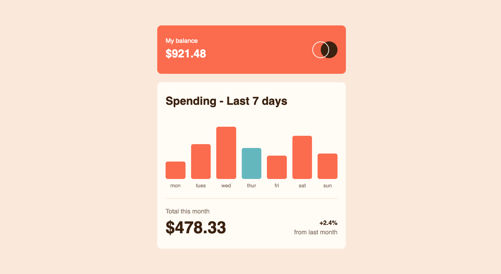

# Frontend Mentor - Expenses chart component solution

This is a solution to the [Expenses chart component challenge on Frontend Mentor](https://www.frontendmentor.io/challenges/expenses-chart-component-e7yJBUdjwt).

## Table of contents

-  [Overview](#overview)
   -  [The challenge](#the-challenge)
   -  [Screenshot](#screenshot)
   -  [Links](#links)
-  [My process](#my-process)
   -  [Built with](#built-with)
   -  [What I learned](#what-i-learned)
   -  [Continued development](#continued-development)
-  [Author](#author)

## Overview

### Requirements

Users should be able to:

-  View the bar chart and hover over the individual bars to see the correct amounts for each day
-  See the current day’s bar highlighted in a different colour to the other bars
-  View the optimal layout for the content depending on their device’s screen size
-  See hover states for all interactive elements on the page
-  **Bonus**: Use the JSON data file provided to dynamically size the bars on the chart

### Screenshot

### Links

-  Solution URL: [Github Respository](https://github.com/jacksonwhiting/expenses-chart-component)
-  Live Site URL: [Live Site](https://jw-expenses-chart-component.netlify.app/)

## My process

### Built with

-  Semantic HTML5 markup
-  CSS custom properties
-  Flexbox
-  CSS Grid
-  Mobile-first workflow
-  Tailwind CSS
-  Vanilla Javascript

### What I learned

I learned how to fetch a JSON file locally, parse the data and dynamically add it to the component.

I used CSS transitions to give the bar chart a bit of animation when it loaded.

I could not figure out how to dynamically change the height without adding the new height as in inline-style. Nothing else seemed to work.

### Continued development

I'd like to continue working with external data using the fetch API. I'd also like to continue to expand my knowledge of CSS animations and transitions. I think animations and transitions can really enhance the UX.

## Author

-  Frontend Mentor - [@jacksonwhiting](https://www.frontendmentor.io/profile/jacksonwhiting)
-  Twitter - [@JWhiting00](https://www.twitter.com/JWhiting00)
